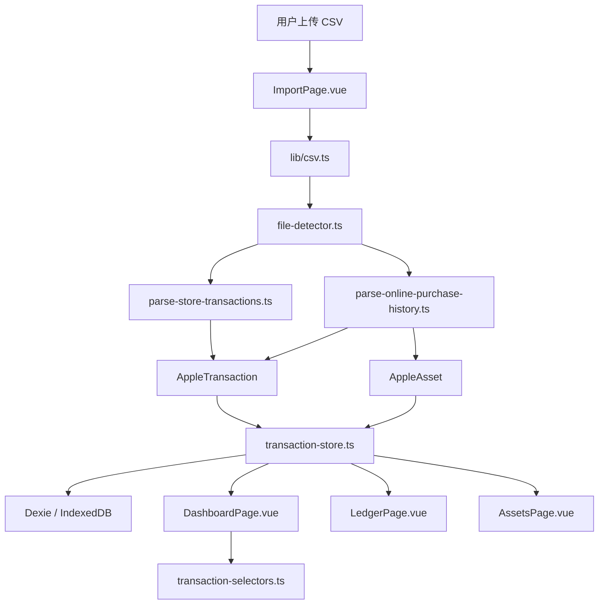

# Apple 消费账本 V1 技术架构总览

## 1. 项目定位

Apple 消费账本 V1 是一个本地优先的前端 Web App，用于解析 Apple 数据与隐私导出的核心 CSV 文件，并在浏览器本地完成账单清洗、统计、明细查询和硬件资产展示。

当前版本聚焦两个核心数据源：

- App Store / 媒体服务账单：`Store Transaction Purchase and Free Apps History.csv`
- Apple Store 硬件订单：`Online Purchase History.csv`

V1 不包含登录、云同步、服务端、ZIP 解析、PDF 报告导出和多用户能力。所有导入数据均在浏览器本地解析，并持久化到 IndexedDB。

## 2. 技术栈

| 分类 | 技术 |
| --- | --- |
| 前端框架 | Vue 3 |
| 构建工具 | Vite |
| 语言 | TypeScript |
| 路由 | Vue Router |
| 状态管理 | Pinia |
| 样式 | TailwindCSS + 自定义 CSS tokens |
| 基础组件 | Element Plus |
| CSV 解析 | PapaParse |
| 金额计算 | decimal.js |
| 日期处理 | dayjs |
| 图表 | ECharts |
| 本地存储 | Dexie + IndexedDB |

## 3. 总体架构



整体采用纯前端分层架构：

- 页面层负责导入、展示、筛选和交互。
- Feature 层负责业务解析、分类、统计和页面级状态组织。
- Lib 层负责 CSV、金额、日期、ID 等通用工具。
- Storage 层负责 IndexedDB 持久化。
- UI 组件层负责 Apple-like 的统一视觉表达。

## 4. 目录结构

```text
src/
  app/
    pinia.ts
    router.ts
  components/
    charts/
      AppleChart.vue
    ui/
      AppleButton.vue
      AppleCard.vue
      AppleDataBadge.vue
      AppleMetric.vue
      ApplePageHeader.vue
      AppleReveal.vue
      AppleSectionTitle.vue
      AppleSegmentedControl.vue
  features/
    apple-media/
      classify-media-transaction.ts
      parse-store-transactions.ts
    apple-store/
      classify-hardware.ts
      dedupe-hardware-orders.ts
      parse-online-purchase-history.ts
    assets/
      AssetsPage.vue
    dashboard/
      DashboardPage.vue
      summary-calculator.ts
    import/
      file-detector.ts
      import-store.ts
      ImportPage.vue
    ledger/
      LedgerPage.vue
    transactions/
      transaction-model.ts
      transaction-selectors.ts
      transaction-store.ts
  lib/
    csv.ts
    date.ts
    id.ts
    money.ts
  storage/
    db.ts
  styles/
    global.css
    tokens.css
```

## 5. 应用入口与路由

应用入口是 `src/main.ts`，负责创建 Vue 应用并挂载：

- Pinia：全局状态管理。
- Vue Router：页面路由。
- Element Plus：基础交互组件。
- 全局样式：`tokens.css` 和 `global.css`。

当前路由定义在 `src/app/router.ts`：

| 路由 | 页面 | 职责 |
| --- | --- | --- |
| `/dashboard` | DashboardPage | 总览实际现金支出、趋势、类别、支付方式、Top 消费 |
| `/ledger` | LedgerPage | 消费明细、筛选、搜索、详情抽屉、CSV 导出 |
| `/assets` | AssetsPage | 硬件资产陈列、分类筛选、状态维护 |
| `/import` | ImportPage | CSV 上传、识别、解析、导入摘要、本地数据清空 |
| `/` | redirect | 默认跳转到 `/dashboard` |

## 6. 数据模型

核心模型定义在 `src/features/transactions/transaction-model.ts`。

### 6.1 统一交易模型

`AppleTransaction` 是所有账单明细的统一模型。App Store 消费和 Apple Store 硬件订单都会被转换为该结构。

关键字段：

- `source`：交易来源，如 `app_store`、`apple_store`、`subscription`、`store_credit`。
- `date`：标准化后的交易日期。
- `title` / `subtitle`：主标题和辅助描述。
- `category`：业务分类，如 iPhone、Subscription、In-App Purchase。
- `amount`：字符串金额，计算时使用 decimal.js。
- `paymentMethod`：支付方式。
- `cashImpact`：是否计入实际现金支出。
- `billValueImpact`：是否计入账单项目价值。
- `isFree`：是否为免费 / 限免项目。
- `isRefund`：是否涉及退款。
- `raw`：保留原始 CSV 行，供详情抽屉排查。

### 6.2 硬件资产模型

`AppleAsset` 用于从 Apple Store 硬件订单生成资产卡片。

关键字段：

- `name`：设备或商品名称。
- `category`：iPhone、iPad、Mac、Apple Watch、AirPods、AppleCare、Accessory 等。
- `purchaseDate`：购买日期。
- `purchasePrice`：购买价格。
- `orderNumber`：订单号。
- `sourceTransactionId`：对应交易 ID。
- `status`：本地维护状态，如使用中、已出售、已闲置、已送人、未知。

### 6.3 导入批次模型

`ImportBatch` 记录一次导入的文件摘要、解析数量、跳过数量和数据质量提示。

## 7. 数据导入流程

导入流程入口在 `src/features/import/ImportPage.vue`，核心逻辑在 `src/features/import/import-store.ts`。

流程如下：

1. 用户拖拽或选择 CSV 文件。
2. `lib/csv.ts` 使用 PapaParse 解析 CSV。
3. `file-detector.ts` 根据文件名和表头识别文件类型。
4. App Store 账单进入 `parse-store-transactions.ts`。
5. Apple Store 硬件订单进入 `parse-online-purchase-history.ts`。
6. 解析结果统一转换为 `AppleTransaction` 和 `AppleAsset`。
7. `transaction-store.ts` 调用 `storage/db.ts` 写入 IndexedDB。
8. 页面显示导入摘要和数据质量提示。

未识别文件会被跳过，并写入 warning。

## 8. 核心清洗口径

### 8.1 App Store / 媒体服务账单

解析器：`src/features/apple-media/parse-store-transactions.ts`

已实现规则：

- `Invoice Item Total = 0` 标记为 `isFree = true`，不计入现金支出。
- `Payment Type` 包含 `Store Credit` 时，`cashImpact = false`，避免余额消费重复计入现金支出。
- 非免费且真实支付方式的记录计入 `cashImpact`。
- `Invoice Item Total - Refund Amount` 作为净金额。
- 有退款金额或净额为负时标记 `isRefund = true`。
- 根据 `Content Type` 和商品描述归类为 App、In-App Purchase、Subscription、Store Credit 等。

### 8.2 Apple Store 硬件订单

解析器：`src/features/apple-store/parse-online-purchase-history.ts`

已实现规则：

- `Description` 和 `Customer Order Number` 同时为空时跳过，视为汇总空行。
- 使用 `Customer Order Number + Line Item + Description + Price Including Tax` 去重。
- 金额使用 `Price Including Tax * Qty`。
- 硬件分类逻辑位于 `classify-hardware.ts`。
- 每条有效硬件订单同时生成一条交易和一个资产。

## 9. 状态管理与持久化

Pinia store 位于 `src/features/transactions/transaction-store.ts`。

状态包含：

- `transactions`：统一交易列表。
- `assets`：硬件资产列表。
- `batches`：导入批次。
- `loaded`：本地数据加载状态。

主要 actions：

- `loadFromStorage()`：从 IndexedDB 恢复本地数据。
- `replaceAll()`：替换全部交易、资产和导入批次。
- `clearAll()`：清空本地数据。
- `updateAssetStatus()`：更新资产状态并写回 IndexedDB。

IndexedDB 层位于 `src/storage/db.ts`，使用 Dexie 定义三个表：

- `transactions`
- `assets`
- `importBatches`

## 10. 统计计算

统计逻辑位于 `src/features/transactions/transaction-selectors.ts`。

当前计算项包括：

- 实际现金支出。
- 账单项目价值。
- 硬件支出。
- 软件 / 订阅支出。
- Store Credit 充值。
- Store Credit 消费。
- 免费 / 限免项目数量。
- 年度趋势。
- 类别汇总。
- 支付方式汇总。
- 最高消费 Top 10。
- 最近消费 Top 10。
- 数据质量提示。

金额汇总统一使用 `decimal.js`，避免 JavaScript 浮点误差。

## 11. 页面架构

### 11.1 Dashboard

文件：`src/features/dashboard/DashboardPage.vue`

职责：

- 展示 Hero Metric：实际现金支出。
- 分层展示硬件、软件 / 订阅、账单项目价值、免费项目数量。
- 使用 ECharts 展示年度趋势、类别占比、支付方式。
- 展示最高消费和最近消费。
- 展示数据质量提示。

### 11.2 Ledger

文件：`src/features/ledger/LedgerPage.vue`

职责：

- 展示完整消费明细。
- 支持关键词、年份、类别、来源、支付方式和现金口径筛选。
- 支持金额排序。
- 支持当前筛选结果导出 CSV。
- 通过详情抽屉展示原始 CSV 字段。
- 移动端切换为列表卡片。

### 11.3 Assets

文件：`src/features/assets/AssetsPage.vue`

职责：

- 从硬件订单生成 Apple 资产陈列。
- 支持按设备类别筛选。
- 展示购买价格、使用时长、月均成本、订单号。
- 支持本地维护资产状态。

### 11.4 Import

文件：`src/features/import/ImportPage.vue`

职责：

- 上传或拖拽 CSV。
- 展示解析规则。
- 展示最近一次导入摘要。
- 清空本地 IndexedDB 数据。

## 12. UI 与设计系统

V1 使用 Apple-like 的轻量设计系统，主要文件：

- `src/styles/tokens.css`
- `src/styles/global.css`
- `tailwind.config.ts`
- `src/components/ui/*`

设计原则：

- 浅色、克制、接近 Apple 官网的数据工具气质。
- 大数字和清晰层级优先。
- 蓝色只用于 CTA、链接、选中态和重点数据。
- Element Plus 只作为基础交互层，视觉上通过 CSS variables 和 Tailwind 覆盖默认后台感。
- 卡片用于独立信息块，不做复杂嵌套。
- 图表少装饰，强调趋势、占比和对比。

## 13. 构建与启动

常用命令：

```bash
npm install
npm run dev
npm run build
npm run typecheck
```

当前 `package.json` scripts：

- `dev`：启动 Vite 开发服务，绑定 `127.0.0.1`。
- `build`：先执行 `vue-tsc -b`，再执行 `vite build`。
- `preview`：预览生产构建。
- `typecheck`：仅执行 TypeScript / Vue 类型检查。

## 14. 当前 V1 边界

当前已实现 V1 的主链路，但仍保持以下边界：

- 不解析 Apple 导出的 ZIP。
- 不自动读取本地文件夹。
- 不做服务端和云同步。
- 不做登录、多用户和权限。
- 不做 PDF / PNG 年度报告导出。
- 不做订阅中心和 Store Credit 独立中心。
- Apple 产品图片素材管理尚未接入，资产页当前使用抽象设备占位视觉。

后续 V2 可以在现有架构上扩展更多解析器、更多页面和更完整的数据质量诊断能力。
